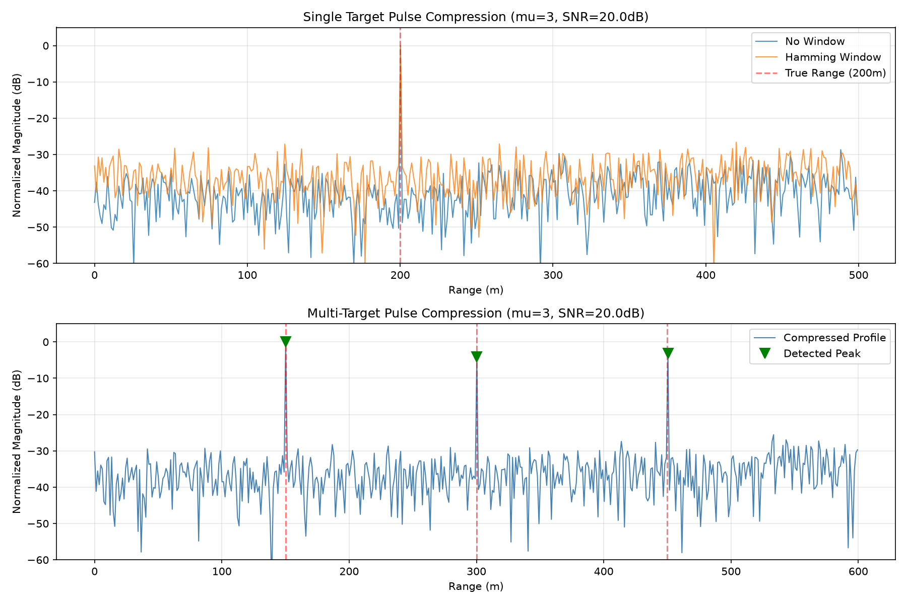
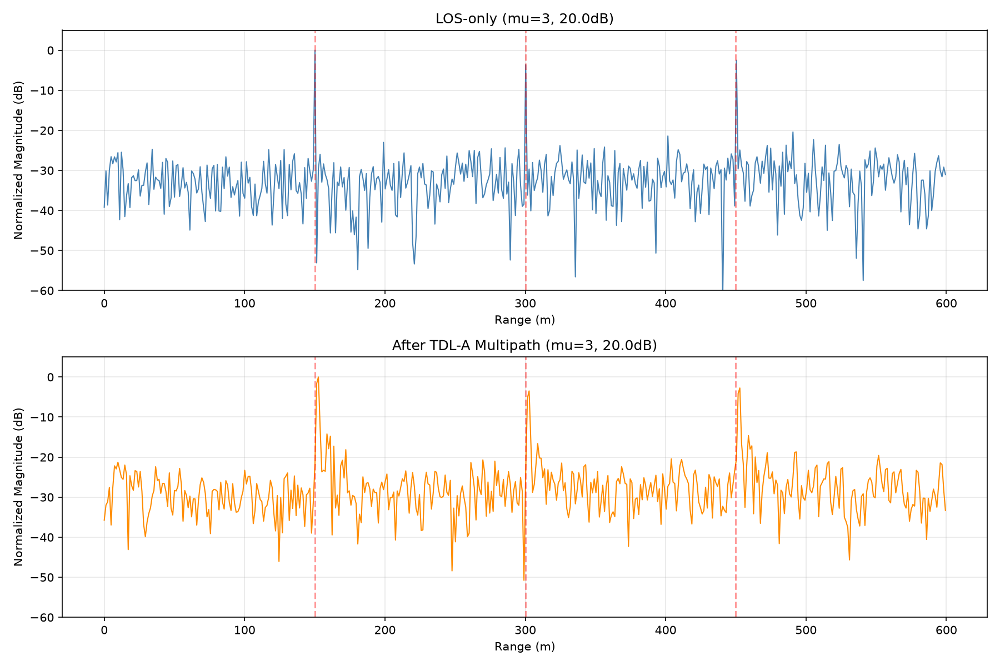
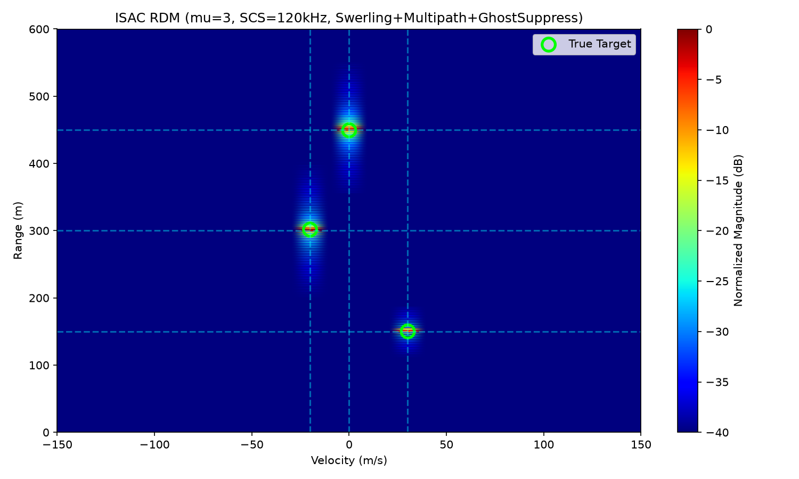
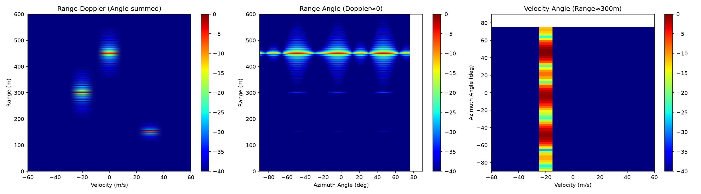
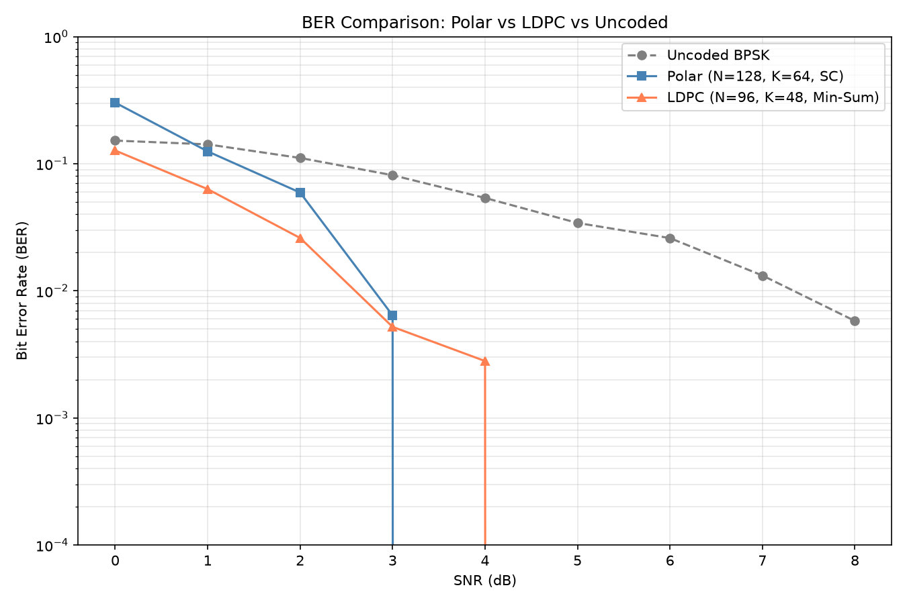
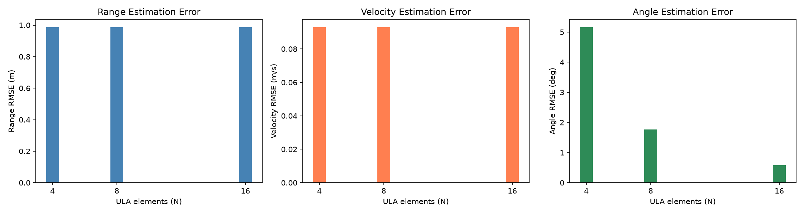
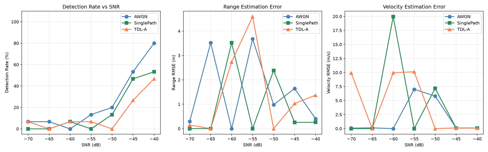
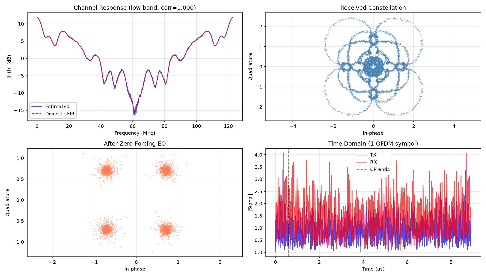
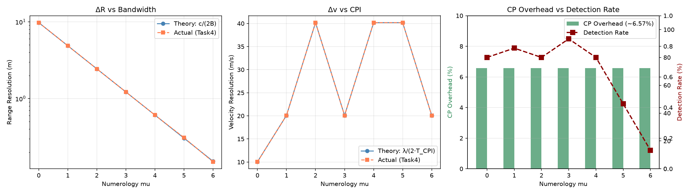

# ISAC-OFDM Agent

基于 3GPP Rel-18 参数的教学/研究型 OFDM-ISAC 仿真原型。

> ⚠️ **项目定位**：本项目用于展示从 3GPP 参数提取到 ISAC 感知处理的完整链路，
> **不声称**严格 3GPP 标准一致性。已知局限详见 [LIMITATIONS.md](LIMITATIONS.md)。

## 项目简介

从 3GPP TS 38.211 v18.4.0 提取 numerology 参数，完成从
**NR 波形生成 → NR 资源网格 → SS/PBCH block → CP-OFDM 全链路
→ 时域脉冲压缩 → 3GPP TDL-A 多径信道 → CFAR 检测 → MIMO 3D 感知
→ 卷积编码 → 自动报告** 的完整 ISAC 链路。

## 核心特性

| 模块 | 功能 | 关键技术 |
|---|---|---|
| **Task1** | 3GPP 参数提取 | pdfplumber + 容错正则，9193 行真实 PDF |
| **Task2** | NR 波形 + 网格 | QPSK/16QAM/64QAM + NR 网格 (DC/Guard/DMRS/PRS) + SS/PBCH |
| **Task3** | ISAC 感知 | 时域脉冲压缩 + TDL-A (23 抽头) + Swerling-I + CFAR + NMS + 鬼影抑制 + MIMO 3D RDA + CP-OFDM 全链路 |
| **Task4** | 性能扫描 | 蒙特卡洛 (50 次) + 95% CI + 分辨率公式验证 |
| **Task5** | 自动报告 | 从 JSON 动态生成 |
| **P3/P4 附加** | 进阶 | (2,1,3) 卷积码 + **Polar SC** + **LDPC Min-Sum** + ULA/UPA + **统一 CLI** |

### 修复状态

- ✅ **P0**：输入路径动态解析 + 诚实定位 + LIMITATIONS.md
- ✅ **P1**：TDL-A 23 抽头 + 功率域 CA-CFAR (Pfa 校准)
- ✅ **P2**：QPSK/16QAM 调制 + 动态报告 + 95% CI + NR 资源网格
- ✅ **P3**：MIMO 3D RDA + 卷积码 + SS/PBCH + CP-OFDM 全链路
- ✅ **P4**（进阶）：TDL FFT 修正 + Bootstrap/Wilson CI + MIMO RMSE + 统一 CLI + Polar/LDPC

## 主要结果

### 时域脉冲压缩



### TDL-A 多径信道对比



### 多径鬼影抑制

使用 3GPP TR 38.901 TDL-A 信道（23 抽头，RMS 30ns）。
**绿色圈** = 真实目标簇中心；**红色叉** = 多径鬼影。



### NR 资源网格


### SS/PBCH Block


### MIMO 3D Range-Doppler-Angle



### 卷积编码 BER 曲线


### Polar vs LDPC BER 对比 (P4.8)



### MIMO 角度 RMSE vs 天线数 (P4.6)



### 基准场景对比 (P4.5)



### CP-OFDM 全链路



### 分辨率公式验证



## 快速开始

```bash
pip install -r requirements.txt
./run_all.sh